# Cloud-Resume-AWS
 This is my resume hosted on a AWS


# Step 1: Create an AWS account and give the account permissions.

First off we want to set up MFA and setup a new user with which we can login to so that we are on the safe side.

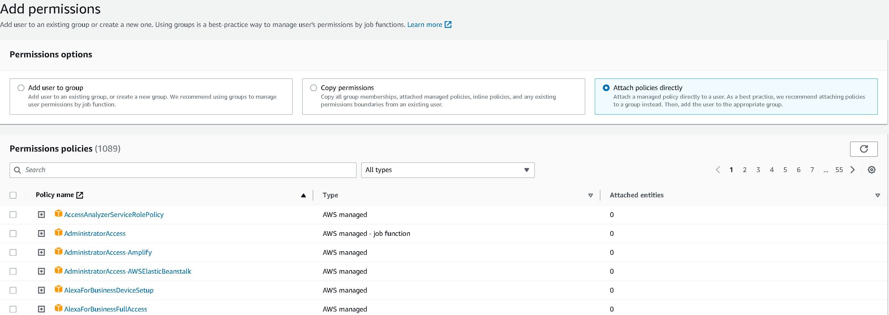

We can add permissions in here to allow our user to handle certain tasks.

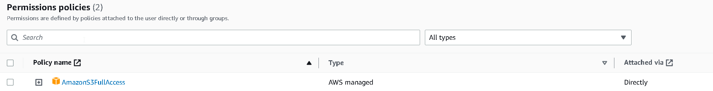

We added our permission of "AmazonS3FullAccess" so that our user has full access to our S3 bucket that we will create later.

# Step 2: Create a S3 Bucket and upload our frontend to it.


Lets type into the search bar "S3" and create a S3 Bucket to which we can upload our frontend onto.

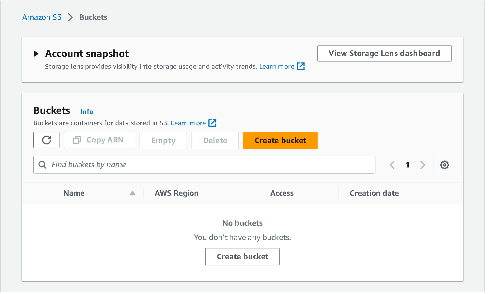

We have no buckets at the moment in here so its all empty. Let us create a new bucket for this project!

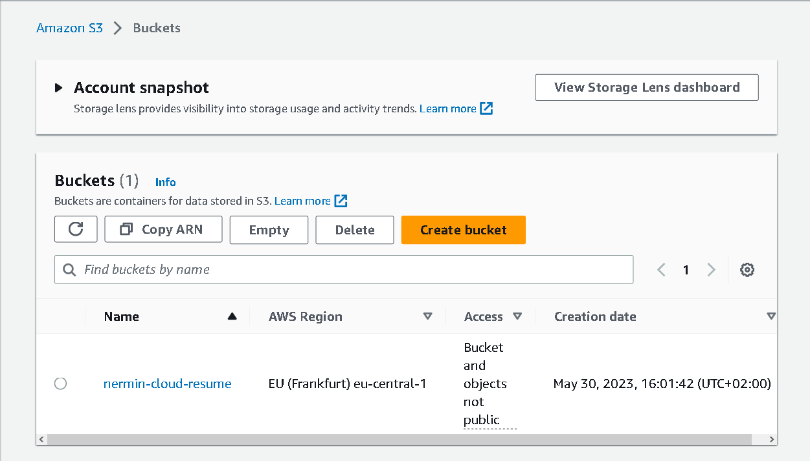

We can now upload files to our bucket so let us upload our frontend folder that we have created for this project onto our bucket.

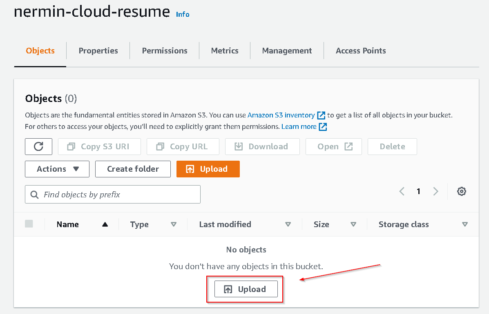

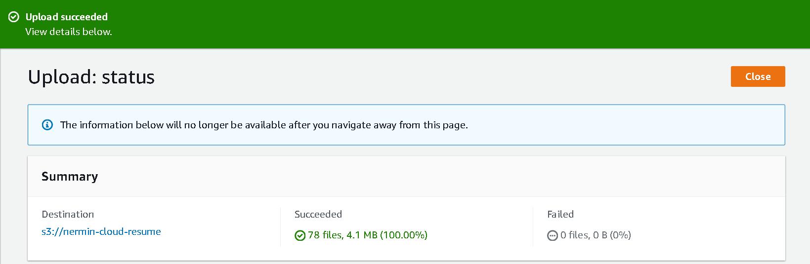

Let us also make sure that our "Default root object" is the "index.html" file of our frontend website. This specifies what the default root object should be, when we access the created CloudFront URL.

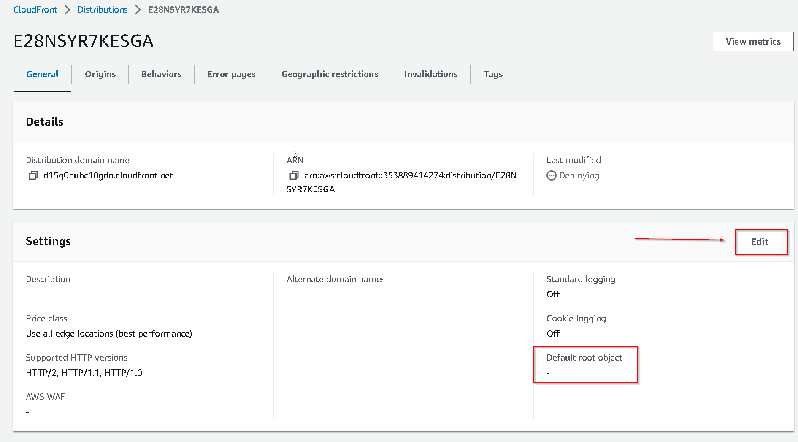

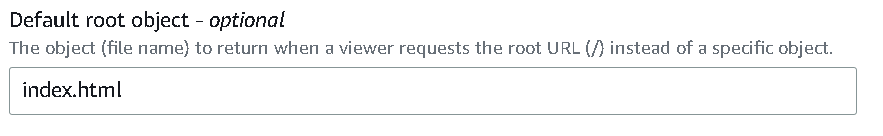

We have made our bucket not public yet so we are not able to access the contents of the bucket yet. For that we will use CloudFront.

## CloudFront

Search up "CloudFront" in the search bar.
CloudFront is a AWS service to handle data with low latency and a high transfer speed.

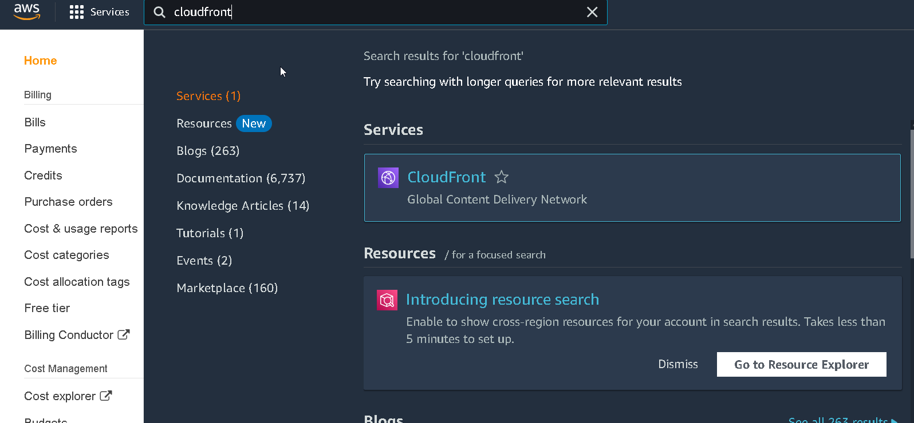

Create a distribution. (Take the S3 Bucket that you have created in the previous step).

We select Origin access control settings for the "Origin access" and then we copy the policy. With this we can allow CloudFront to use these settings to allow us to see the insides of the specified bucket.

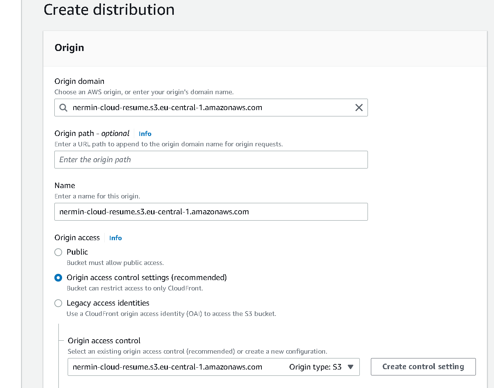

We go back to the CloudFront settings and under "Viewer protocol policy" we select "HTTPS only" so that our connection is secured.

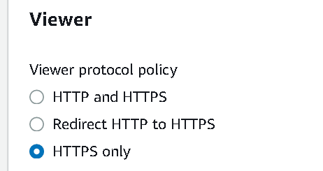

Now we can go back to the Distribution and copy the policy. go on our Bucket policy and edit it.

Paste the policy that we have gotten from the CloudFront to the policy editor.

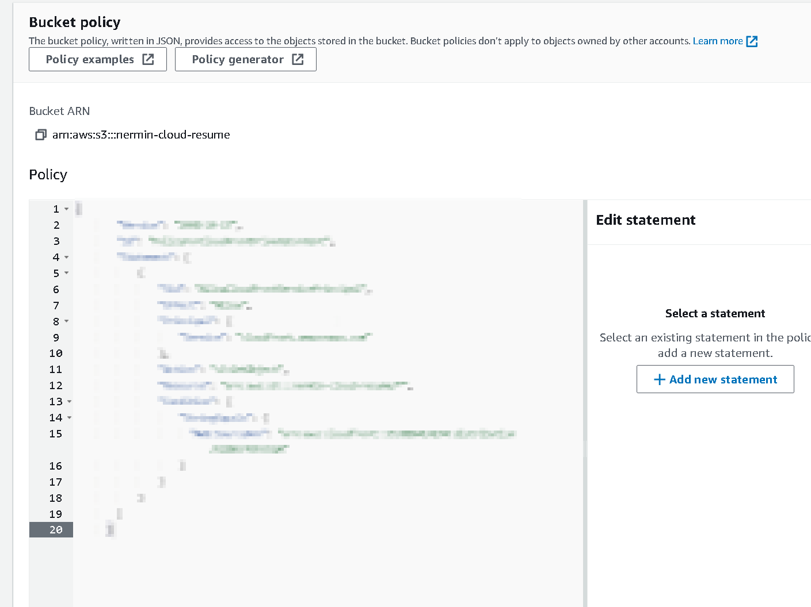

## Adding DNS

With the help of Route53 we can add our own custom domain into this project.
I will skip this step since I am using AWS free tier and it only has limited resources.

# Step 3: API and DynamoDB

Lets search for "DynamoDB" in the search bar and create a table.

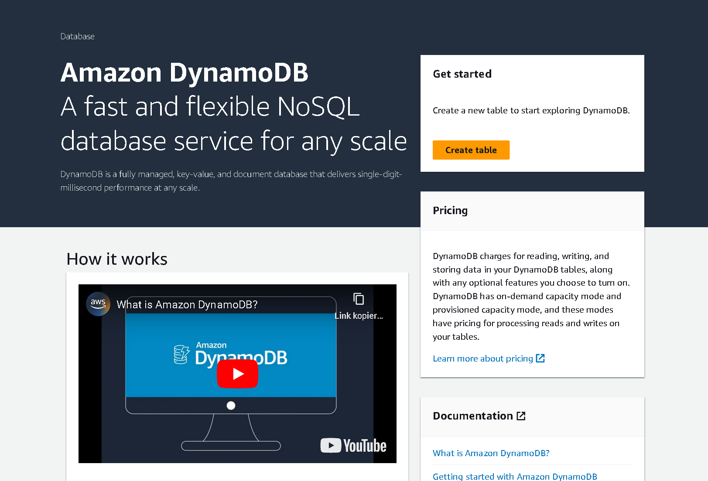

Its important that we create a "Partition key" mine will be set to "id".


We now have created a DynamoDB table so let us create an item inside of the table.

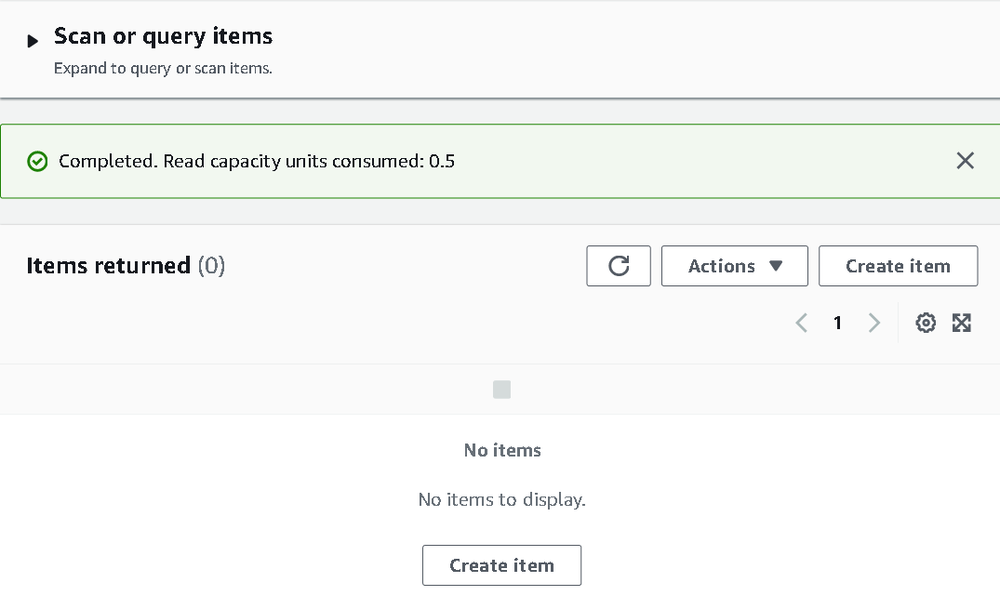

Now we want to create an item that stores our "views".


# API

Since we don't want to fetch directly from DynamoDB we will create a lambda function that does that for us.

So let us create a lambda function. We type in "lambda" into the search bar and create a new lambda function.

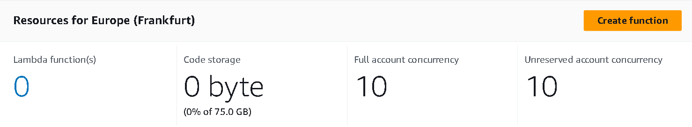

This is pretty straight forward. We pick our programmming langauge that we are going to use to create the backend. I choose Python.

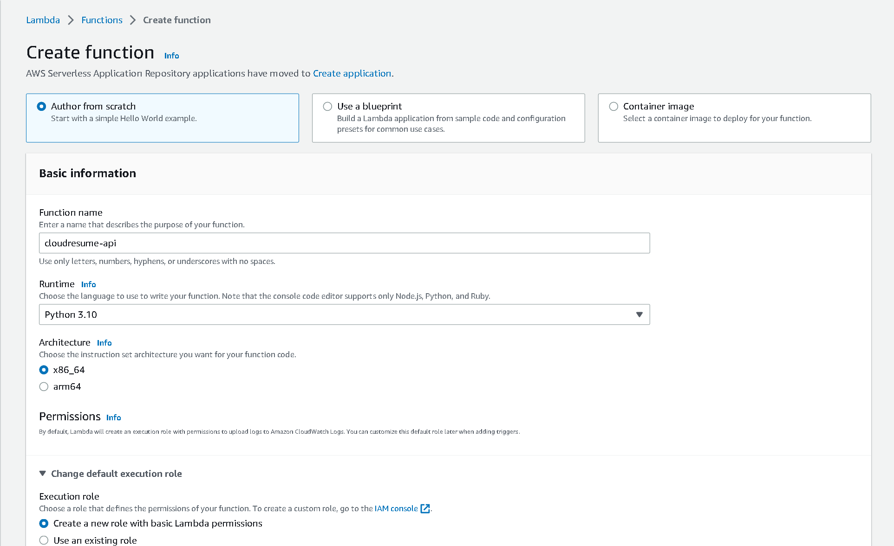

Inside of the advanced settings I also enable the function URL. So that we can assign HTTPS endpoints to our Lambda function. So we gain a public URL with which we can invoke our lambda function through.

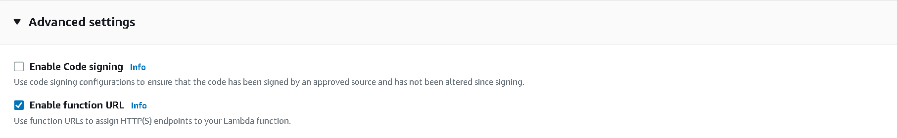

Settings I also enable are.

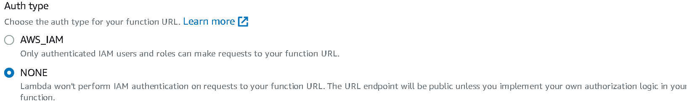

So that there is no authentication needed.

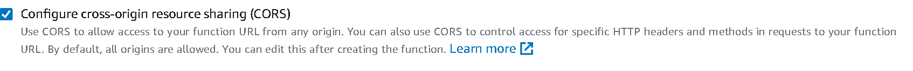

with CORS we can whitelist our own domain to have access to our resume.

With these settings we can create our Lambda function now.

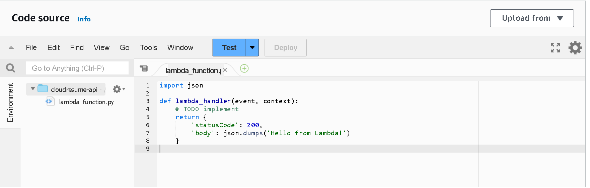

Now we can edit our lambda function. We want to create a function that fetches data from the DynamoDB database.

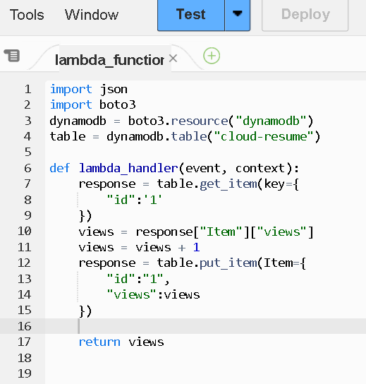

Let us go one by one what the code does.

boto3 is used to interact with AWS services and we specify that we want to interact with the "dynamodb" data source.

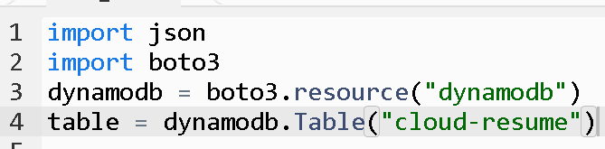

In the line below we are calling our table that we have created in the previous step.

Then we get an item from the table where the id equals 1. Since this is where our value "views" is stored.

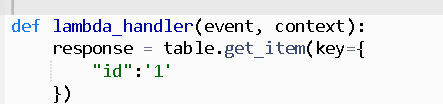

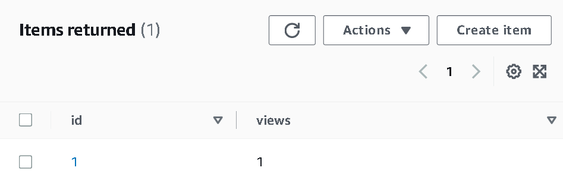

Then we want to take the view count and increase it by 1.

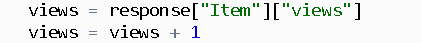

At the end we update the table with the new view count that got increased by one.

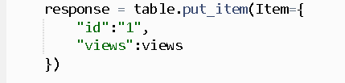

We also have to update the permissions of the lambda function so that it can update the viewer count.


Let us attach a dynamodb policy.

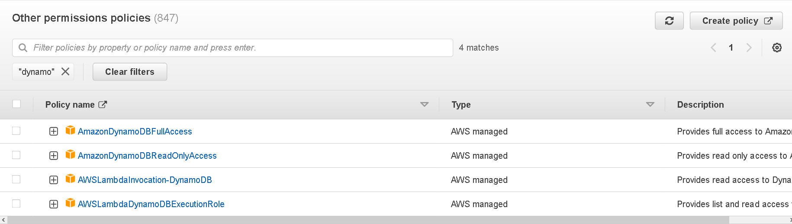

We go with the "FullAccess" one.

# JavaScript (Frontend)

Now we want to write a function inside of our frontend that updates the counter.

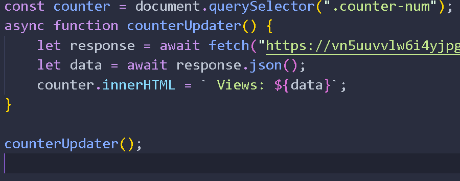

`const counter = document.querySelector(".counter-num");`

Is a variable that selects "counter-num" inside of my index.html file.

I have also linked my index.js file inside of my index.html file.


`
````js
async function counterUpdater() {

    let response = await fetch("https://vn5uuvvlw6i4yjpgk5x5pg45oe0qhlis.lambda-url.eu-central-1.on.aws/")

    let data = await response.json();

    counter.innerHTML = ` Views: ${data}`;

}

`````


We have made a function called "counterUpdater" which does a fetch request to our lambda API.
The data that the fetch request gets is getting stored inside of a variable called "data".
Now we update the "counter-num"  inside of our HTML file so it shows the actual view count from our DynamoDB database.

````js
counterUpdater();
`````

At the end we just call the function.


# CI/CD

We want to make sure that if we update something in our code that it gets pushed to our GitHub aswell as the S3 Bucket on AWS. And for that we use CI/CD pipelines.

````
name : Upload website to S3

  

on:

  push:

    branches:

    - main

  

jobs:

  deploy:

    runs-on: ubuntu-latest

    steps:

    - uses: actions/checkout@master

    - uses: jakejarvis/s3-sync-action@master

    with:

      args: --acl public-read --follow-symmlinks --delete

    env:

      AWS_S3_BUCKET: ${{ secrets.AWS_S3_Bucket}}

      AWS_ACCESS_KEY_ID: ${{ secrets.AWS_ACCESS_KEY_ID}}

      AWS_SECRETS_ACCESS_KEY: ${{ secrets.AWS_SECRET_ACCESS_KEY}}

      AWS_REGION: "eu-central-1"

      SOURCE_DIR: "frontend"
`````


The yaml file triggers when there is a push on the main branch.

````
on:

  push:

    branches:

    - main
`````

It runs on the latest Ubuntu container.

````
jobs:

  deploy:

    runs-on: ubuntu-latest
`````

We then use an action from "jakejarvis" that we can find on the AWS marketplace With some arguments.

````
    steps:

    - uses: actions/checkout@master

    - uses: jakejarvis/s3-sync-action@master

    with:

      args: --acl public-read --follow-symmlinks --delete
`````

We also need secret keys since without them we wont be able to upload our data (Not gonna show mine here).

````
    env:

      AWS_S3_BUCKET: ${{ secrets.AWS_S3_Bucket}}

      AWS_ACCESS_KEY_ID: ${{ secrets.AWS_ACCESS_KEY_ID}}

      AWS_SECRETS_ACCESS_KEY: ${{ secrets.AWS_SECRET_ACCESS_KEY}}

      AWS_REGION: "eu-central-1"

      SOURCE_DIR: "frontend"
`````

Now we can push our yaml file onto GitHub. If we go into actions we should see something like this.

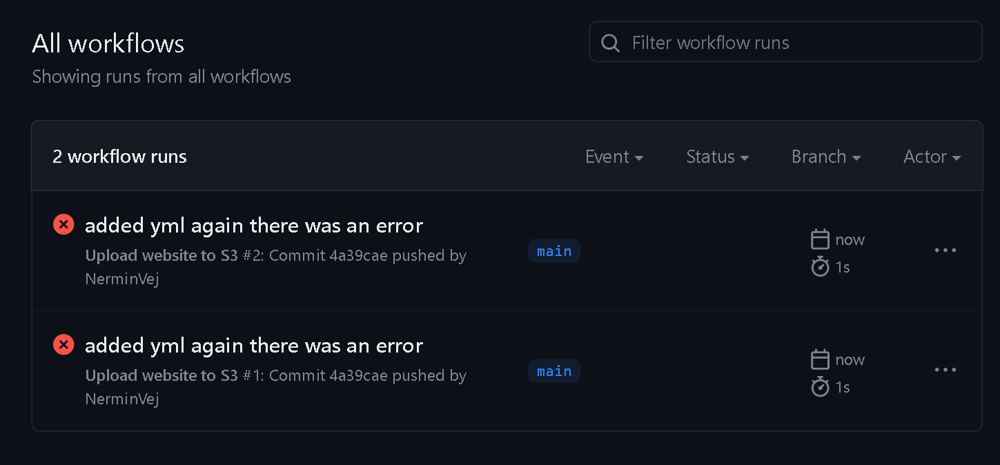

This is because there are no secret keys that got set up.
We can set this up in the settings tab.


Then we go on "Secrets and variables". Here we can set them up.

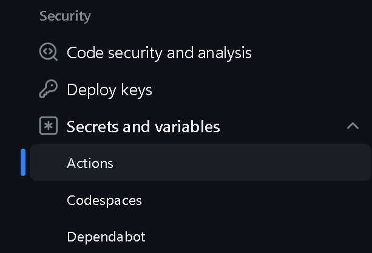

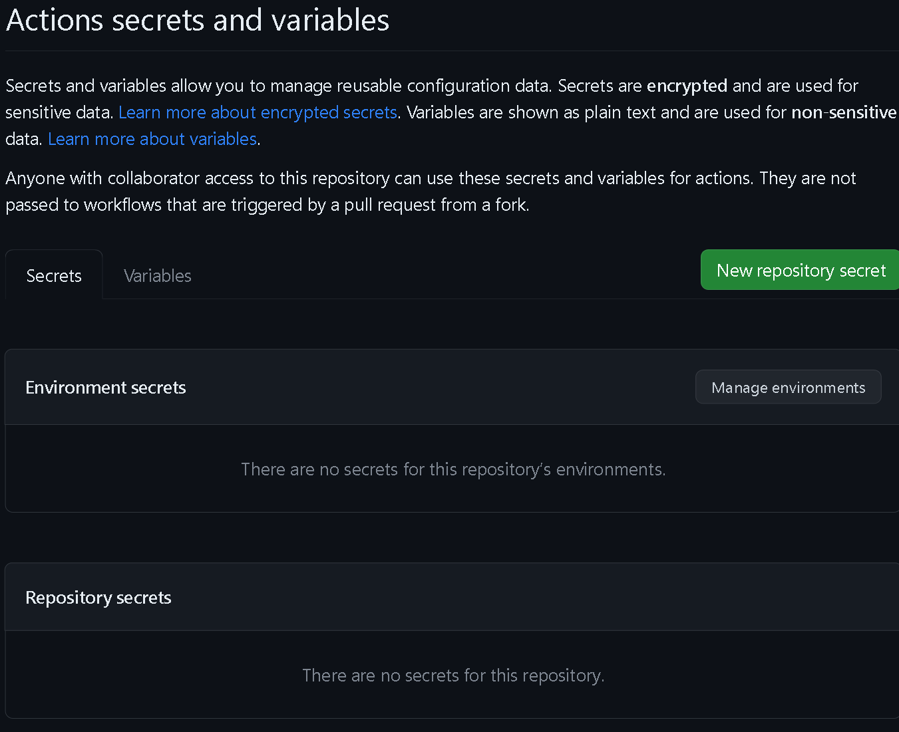


# Terraform (IaC)

So now we do IaC with Terraform. We create first a provider.tf file and then a main.tf file with all of our main IaC code in it.

````
terraform {
  required_providers {
    aws = {
      source  = "hashicorp/aws"
      version = "3.60.0"
    }
  }
}

provider "aws" {
  region = "eu-central-1"
  access_key = "YOUR_ACCESS_KEY"
  secret_access_key = "YOUR_SECRET_ACCESS_KEY"
}
`````

We first set up the required provider, since we can use Terraform with multiple cloud providers.
Then we set up which region we are on and what our secret keys are (again left blank by me here).

Now we create the main.tf file where our main IaC will go.

We start with our lambda function.

````
resource "aws_lambda_function" "myfunction" {
    filename = data.archive_file.zip.output_path
    source_code_hash = data.archive_file.zip.output_base64sha256
    function_name = "myfunction"
    role = aws_iam_role.iam_for_lambda.arn
    handler = "function.handler"
    runtime = "python3.10"
}
`````

We start off with our "aws_lambda_function" block that creates an AWS Lambda function with the specified properties:
- filename
	- Reference to the output path of the ZIP archive created by the "data.archive_file.zip".
- source_code_hash
	- Uses the output SHA256 hash of the ZIP archive created by the "data.archive_file.zip".
- function_name
	- Specifies the name of the Lambda function.
- role
	- References the ARN of the IAM role created by the "aws_iam_role.iam_for_lambda" resource.
- handler
	- Specifies the handler for the Lambda function.
- runtime
	- It sets the runtime for the Lambda function to Python 3.10

The "aws_iam_role" resource block creates an IAMM role with the necessary trust policy for the Lambda function to assume the role. It specifies the name of the IAM role and the JSON policy document using the "assume_role_policy" parameter.

````
resource "aws_iam_role" "iam_for_lambda" {
    name = "iam_for_lambda"
    assume_role_policy = >>EOF
    {
        "Version": "2012-10-17",
        "Statement": [
            {
                "Action": "sts:AssumeRole",
                "Principal": {
                    "Service": "Lambda.amazonaws.com"
                },
                "Effect": "Allow",
                "Sid": ""
            }
        ]
    }
    EOF
}
`````

The "data.archive_file.zip" block creates a ZIP archive of the "lambda/" directory within the module. It specifies the source directory using ``${path.module}/lambda/`` and the output path of the ZIP archive using ``${path.module}/packedlambda.zip.``

````
data "archive_file" "zip" {
    type = "zip"
    source_dir = "${path.module}/lambda/"
    output_path = "${path.module}/packedlambda.zip"
    
}
`````

With ``terraform init`` , ``terraform plan`` and ``terraform apply`` we can apply the configurations and create the Lambda function and IAM role.

We also create the lambda function "myfunction" with python. This will be the same as the lambda function that we have created in the "Lambda Function" section.

If we apply the terraform file we will see that our Lambda function wont have a function URL set up. For that we need to add another resource.

````
resource "aws_lambda_function_url" "url1" {
    function_name = aws_lambda_function.myfunc.function_name
    authorization_type = "NONE"

    cors {
        allow_credentials = true
        allow_origins = ["*"]
        allow_methods = ["*"]
        allow_headers = ["date", "keep-alive"]
        expose_headers = ["keep-alive", "date"]
        max_age = 86400
    }
}
`````

At first we want to create a Lambda function URL relationship. And with "NONE" we make sure, that there is no form of authorization required.

The "cors" block specifies the CORS sconfiguration for the Lambda function endpoint. We can set up here that it should only allow requests from only our own resume website but I have it set to allow all origins with the "*".


